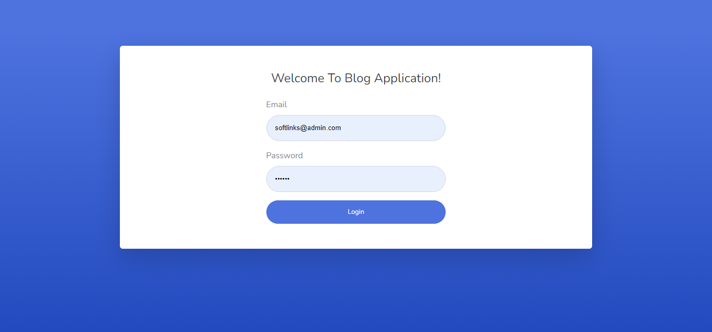

# Softlinks-Task | Laravel 9 + Bootstrap 4 

You are tasked with creating a simple blog application using Laravel. The blog application should allow users to perform the following actions:


## Features

•	View all Employees

•	Create a new Employee

•	Edit an existing Employee

•	Delete an Employee

•	Import Employee from a CSV file

•	Export all Employee to a Excel file

•	Attach a file to employee doc


## Tech Stack

**Tech:** HTML, CSS, JavaScript, jQuery, VueJs, Bootstrap 4

**Server:** PHP, Laravel 9

**DataBase:** MySQL

## Installation

Install All Packages of laravel
```bash
composer install
```

Generate Application key

```bash
php artisan key:generate
```

Update .env File with Database credentials and run migration.
```bash
php artisan migrate 
```

All Set ! now serve laravel app on local and open app in browser.

Login With Admin
```bash
Email - softlinks@admin.com
Password - 123456
```
## Screenshots



